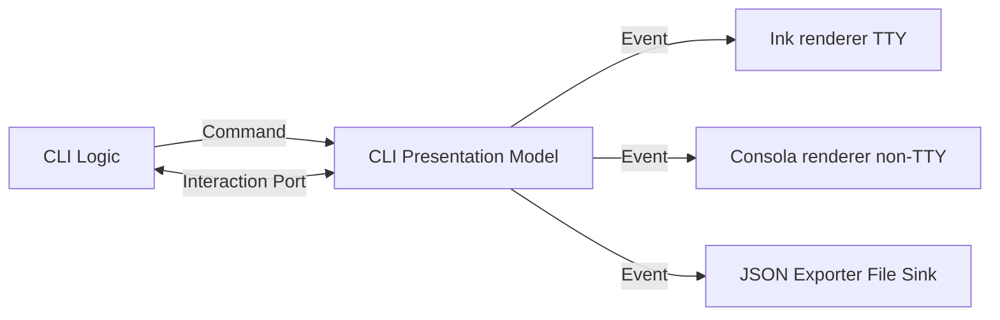

# Kagespect Monorepo

**Semantic output for modern CLIs.**

This monorepo currently contains:

- `packages/core` — Pure TypeScript nucleus (Deno/ESM)
- `packages/renderer-consola` — Minimal non-TTY renderer using Consola (npm)

## Dev

```bash
deno task fmt
deno task lint
deno task test
```

---

# CLI Presentation Model & アーキテクチャ設計書

**版**: v0.2 (2025-09-13)

## 目的

大量の CLI を量産する前提で、**ロジックと表示実装を疎結合**に保つための共通抽象を定義する。本設計は **CLI Presentation Model** と呼び、CLI の実行過程でユーザーに提示・やりとりされる情報を **意味論的に記述する層** を提供する。Ink や Consola といったレンダラはこのモデルのイベントを解釈して出力する。

---

## 全体像

* **ロジック**は Presentation Model へ\*\*コマンド（意図）\*\*を送る。
* **Presentation Model**はコマンドを\*\*イベント（事実）\*\*へ正規化し、購読者（レンダラ）へ通知する。
* **レンダラ**はイベントを受け取り、環境（TTY/非TTY/CI 等）に応じた表現に変換する。
* \*\*入力（Prompt）\*\*はイベント駆動ではなく **インタラクションポート（関数）** としてモデル外に分離し、Promise ベースで回答を返す。監査のために Telemetry イベントを残すことは可能。



---

## ドメイン語彙（名詞）

**Session / Section / Group / Task / Step / Log / Diagnostic / Span / Table / Artifact / Summary / ContextFrame / Stream / MetricSeries / MetricPoint / Batch / Prompt(Port)**

### 基本型

* **識別子/時間**: `Id`, `Millis`
* **重要度/永続性**: `Level`, `Importance`, `Persistence`
* **ラベル**: `Labels`
* **テキスト**: `RichText`

---

## コンテキスト階層（Hierarchy / Context Stack）

* 静的ツリー: `Section/Group/Task/Step` は `parentId?` を許容し、階層構造を表現。
* 実行時スタック: `ContextFrame { kind, id, title?, labels? }` を **push/pop** することで「いまどこを処理中か」を表現。

**イベント**:

* `ContextPushed`, `ContextPopped`

---

## タスクと進捗（Task / Step）

* **Task**: 作業単位。`total` が不明でもよい。
* **Step**: Task の下位工程。

**イベント**:

* `TaskStarted`, `TaskProgressed`, `TaskMessage`, `TaskFinished`

設計要点:

* 進捗は**現在値のみ**を渡す。
* `persistence` で確定行と一時表示を区別。

---

## ストリーム出力（StreamOutput）

長尺の標準出力やログを意味付け。

**イベント**:

* `StreamOpened`, `StreamChunk`, `StreamClosed`

---

## テレメトリ/メトリクス（Telemetry / Metric）

実行時観測値の統一表現。

**イベント**:

* `MetricSeriesDefined`, `MetricObserved`, `MetricSeriesEnded`

---

## ログ/診断/成果物/表/要約

* **Log**: 任意メッセージ。
* **Diagnostic**: 警告・エラー。LSP 的属性を持てる。
* **Artifact**: 生成物（file/dir/url/blob）。
* **Table**: 表形式の結果。
* **Summary**: 実行全体のまとめ。

---

## Prompt / Interaction Port

Prompt は **イベント制御ではなくポート**として扱う。ロジックは Presentation Model から提供されるポートを呼び、Promise ベースで結果を得る。監査・再現用には `PromptRequested/PromptAnswered` を Telemetry イベントとして記録できる。

### インタラクションポート例

```ts
export interface CliInteractionPort {
  capabilities(): UiCapabilities;
  confirm(schema: ConfirmSchema, opts?: PromptOpts): Promise<boolean>;
  input(schema: InputSchema<string>, opts?: PromptOpts): Promise<string>;
  password(schema: InputSchema<string>, opts?: PromptOpts): Promise<string>;
  select(schema: SelectSchema<string>, opts?: PromptOpts): Promise<string>;
  multiSelect(schema: SelectSchema<string>, opts?: PromptOpts): Promise<string[]>;
  form<T>(schema: FormSchema<T>, opts?: PromptOpts): Promise<T>;
}
```

---

## Batch / Group

* **Batch**: 複数 Task の並列集合。
* **Group**: Section 内のまとまり。折り畳みヒントを持つ。

---

## コマンドとイベント

### コマンド（意図）

```
beginSession, endSession
openSection, startTask, progress, taskMsg, finishTask
pushContext, popContext
openStream, writeStream, closeStream
defineSeries, observe, endSeries
appendLog, emitDiag, publishTable, addArtifact, publishSummary
```

### イベント（事実）

```
SessionStarted/Ended
SectionOpened
TaskStarted/Progressed/Message/Finished
ContextPushed/ContextPopped
StreamOpened/Chunk/Closed
MetricSeriesDefined/Observed/Ended
LogAppended, Diagnostic, TablePublished, ArtifactAdded, SummaryReady
PromptRequested/Answered (任意・Telemetry)
BatchStarted/Progressed/Finished
GroupOpened/Closed
```

---

## UIモデルAPI

```ts
interface UiEventSink { emit(ev: Event): void | Promise<void>; }

interface UiModel {
  dispatch(cmd: Command): void | Promise<void>;
  on(sink: UiEventSink): void;
  off(sink: UiEventSink): void;
  state(): Readonly<UiState>;
}
```

---

## 不変条件

* `beginSession` 前のイベントは禁止。
* `ContextPopped` は LIFO を守る。
* `StreamChunk.seq` は per-stream 単調増加。
* `endSession` 後の発火は禁止。

---

## 環境ポリシー

* **TTY**: Ink レンダラで動的表現。
* **非TTY/CI**: Consola レンダラや JSON Exporter で静的表現。
* **色制御**: `NO_COLOR`/`FORCE_COLOR` を尊重。

---

## バージョニング

* **SemVer** を採用。型追加は Minor、破壊は Major。
* `Session.meta` に schema version を記録。

---

## テスト戦略

* コマンド→イベントの正規化をプロパティテスト。
* イベントストリームのリプレイで再現性を検証。
* 大量 StreamChunk で順序保持と容量境界を検証。

---

## 今後の拡張候補

* Prompt の詳細スキーマと非対話ポリシー。
* Metric 集計や要約の標準化。
* Artifact ライフサイクル管理。
* Batch の依存関係表現。

---

## 付録: 実装心得

* ロジックは**意味だけ送る**。色/幅/再描画はレンダラの責務。
* **永続/一時**の区別を明確に。
* **順序性**を守る: `seq` と `at` を必ず付与。
* **多重出力**（画面 + JSON）を前提に設計。
